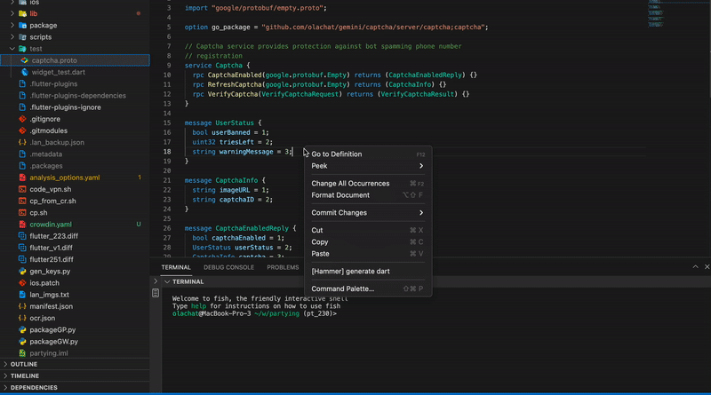
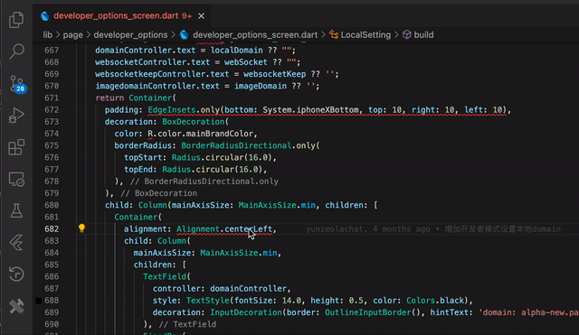
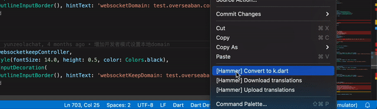
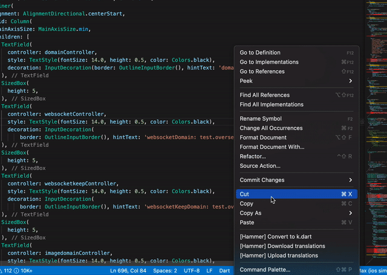

[<p align="left"></p>](https://marketplace.visualstudio.com/items?itemName=zhileichen.hammer)

#  Hammer Visual Studio Code Plugin 


[Get it from the VS Code Marketplace →](https://marketplace.visualstudio.com/items?itemName=zhileichen.hammer) 

## Prerequisites
You need to have node and npm installed on your system to run the project. It is recommended to use the node version used for VS Code development itself which is documented here.

For more information, please refer [vscode extension developement guideline ](https://code.visualstudio.com/api/get-started/your-first-extension)


## Configuration
To work with the Hammer plugin in the Visual Studio Code workspace, you need to create a configuration file named `hammer.yaml` in your project.

Configuration file `hammer.yaml` example:

```
project_id: 405814  #open project and go to Integrations > API
directory_id: 20    # 
api_token: ''       #open profile settings and go to API > New Token > create Token
base_path: "./"      #optional
preserve_hierarchy: true     #optional

files:
  -
    source: '%module_name%/assets/locale/*_zh_CN.json'
    translation: 'client/%module_name%_%file_name%.json'
    directory: 'client'
    languages_mapping: &anchor
      locale:
        'zh-TW': 'zh_TW'
        'zh_TW': 'zh-TW'
```

## Running the project

- Run `npm install` in terminal to install dependencies
- Run the `Run Extension` target in the Debug View. This will:
	- Start a task `npm: watch` to compile the code
	- Run the extension in a new VS Code window

## Features
- Generate Dart models and API code based on proto

- Untranslated text detection and one-click correction

- Custom rule detection for improper control usage and one-click correction

- Quick import and compression of image files

- One-click synchronization of Crowdin's translated text to the local project

- One-click upload of the text to be translated to Crowdin

