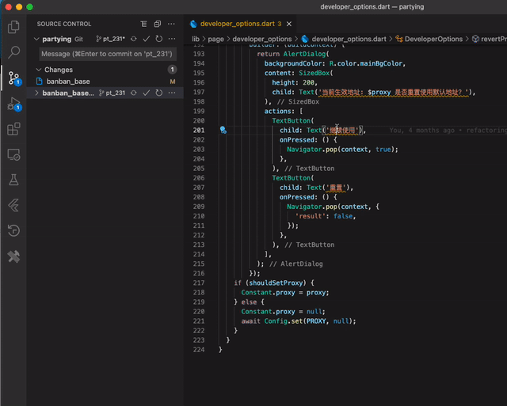

[

](https://marketplace.visualstudio.com/items?itemName=zhileichen.hammer)

# Hammer Visual Studio Code Plugin 

[Get it from the VS Code Marketplace →](https://marketplace.visualstudio.com/items?itemName=zhileichen.hammer)

## Features
1. 未翻译的文本检测和一键修复

2. 自定义规则检测不合规控件使用并一键修复 
3. 一键同步crowdin的翻译文本到本地项目
4. 一键上传待翻译文本到crowdin